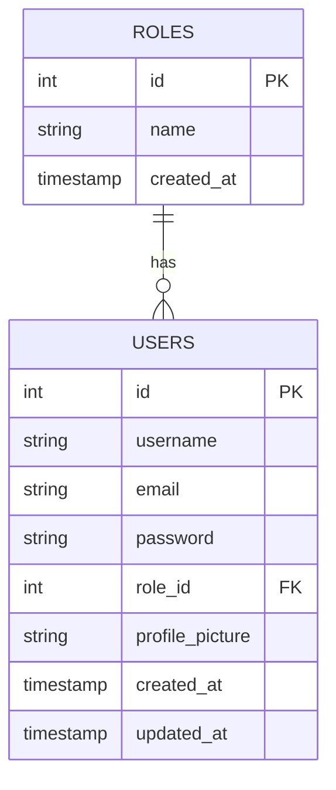

# Database Normalization

## Overview
Database normalization is the process of organizing the attributes and tables of a relational database to minimize data redundancy and improve data integrity. Our User Management System database follows the first three normal forms (1NF, 2NF, 3NF).

## First Normal Form (1NF)
A relation is in first normal form if and only if the domain of each attribute contains only atomic (indivisible) values, and the value of each attribute contains only a single value from that domain.

### Our Implementation:
- Each field in our tables contains only atomic values
- Each record is unique with a primary key
- No repeating groups or arrays in any field

Example from Users table:
```
id | username | email           | password
1  | john_doe | john@example.com| $2y$10$...
2  | jane_doe | jane@example.com| $2y$10$...
```

## Second Normal Form (2NF)
A relation is in second normal form if it is in 1NF and no non-prime attribute is dependent on any proper subset of any candidate key of the relation. A non-prime attribute is an attribute that is not part of any candidate key.

### Our Implementation:
- All our tables are in 1NF
- All non-key attributes are fully functionally dependent on the primary key
- We have no partial dependencies

In our Users table, all attributes (username, email, password, role_id, etc.) depend on the entire primary key (id), not just part of it.

## Third Normal Form (3NF)
A relation is in third normal form if it is in 2NF and there is no non-trivial functional dependency of attributes on something other than a superset of a candidate key. In other words, there should be no transitive dependency of attributes on the primary key.

### Our Implementation:
- All our tables are in 2NF
- No transitive dependencies exist
- All non-key attributes depend directly on the primary key

In our design, we've separated roles into a separate table to eliminate transitive dependencies. If we had stored the role name directly in the Users table, it would create a transitive dependency:
Users.id → Users.role_name → Roles.description

Instead, we use:
- Users.role_id (foreign key to Roles table)
- This eliminates the transitive dependency

## Entity Relationship Diagram



## Benefits of Normalization

1. **Elimination of Redundant Data**: 
   - Storing role information in a separate table prevents duplication
   - If we need to change a role name, we only update it in one place

2. **Data Integrity**:
   - Foreign key constraints ensure referential integrity
   - Each user must have a valid role_id that exists in the Roles table

3. **Storage Efficiency**:
   - Reduced storage space due to elimination of redundant data
   - More efficient data updates

4. **Flexibility**:
   - Easy to add new roles without modifying the Users table
   - Easy to extend role attributes without affecting user records

## Trade-offs

While normalization provides many benefits, it also has some trade-offs:

1. **Query Complexity**:
   - Requires JOIN operations to retrieve related data
   - More complex queries may impact performance

2. **Performance Considerations**:
   - Denormalization might be needed for performance optimization in some cases
   - Proper indexing is crucial for maintaining performance

Our design strikes a good balance between normalization principles and practical performance considerations.