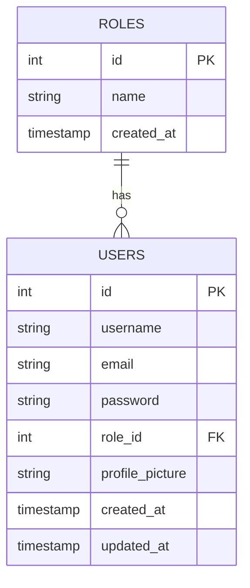

# Entity Relationship Diagram

```mermaid
erDiagram
    ROLES ||--o{ USERS : has
    ROLES {
        int id PK
        string name
        timestamp created_at
    }
    
    USERS {
        int id PK
        string username
        string email
        string password
        int role_id FK
        string profile_picture
        timestamp created_at
        timestamp updated_at
    }
```