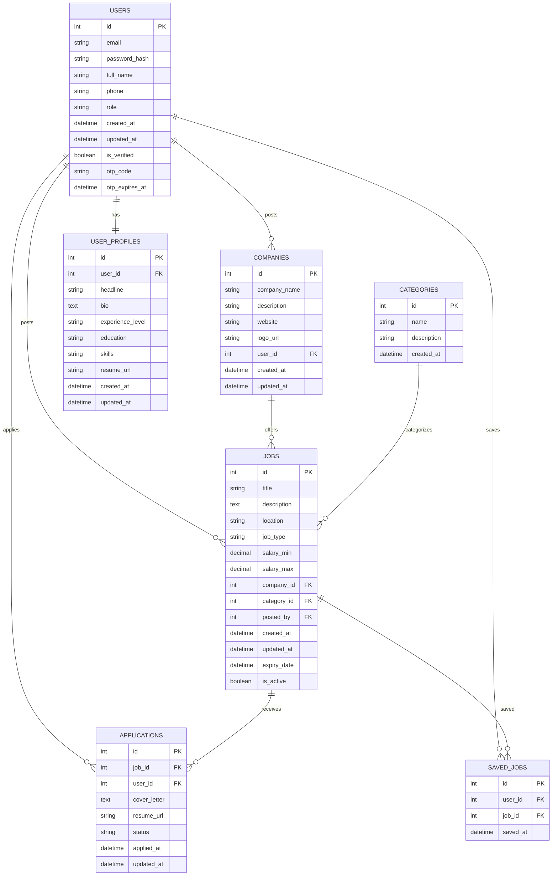

# Job Board Database ER Diagram

## Table Descriptions

### USERS
Stores all user information including job seekers and employers. Contains authentication fields and OTP verification details.

### COMPANIES
Information about companies that post jobs. Linked to USERS table as employers are also users.

### CATEGORIES
Job categories like "Technology", "Healthcare", "Finance", etc.

### JOBS
Detailed job postings with all relevant information including title, description, salary range, location, etc.

### APPLICATIONS
Records of job applications made by users for specific jobs.

### USER_PROFILES
Extended profile information for job seekers including resume, skills, education, etc.

### SAVED_JOBS
Allows users to save jobs for later reference.